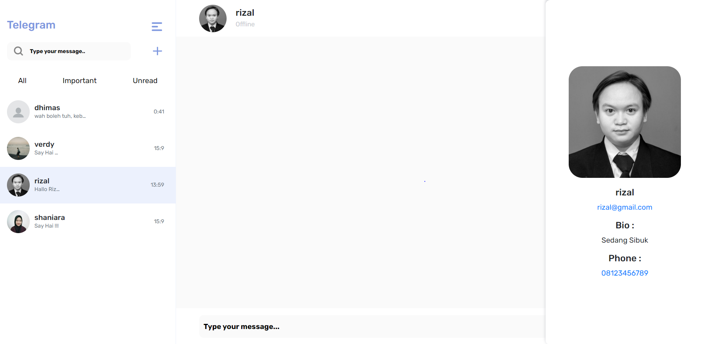
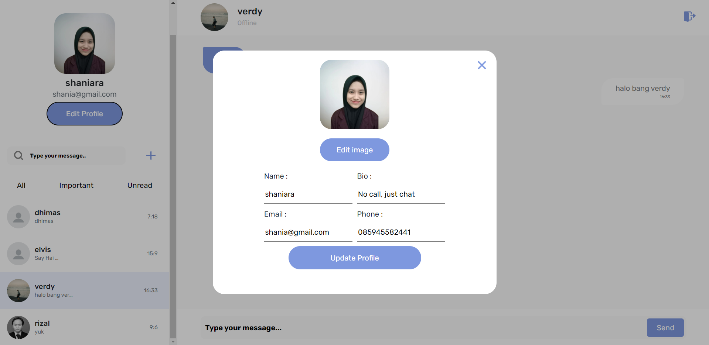

<br />
<p align="center">

  <h3 align="center">Telegram Application</h3>
  <p align="center">
    <image align="center" width="100" src='/images/telegram.jpg' />
  </p>
  <p align="center">
    <a href="https://telegram-fe-pink.vercel.app/">View Demo</a>
  </p>
</p>

<!-- TABLE OF CONTENTS -->

## Table of Contents

- [About the Project](#about-the-project)
  - [Project Structure](#project-structure)
  - [Screenshots](#screenshots)
  - [Package Modules](#package-modules)
- [Getting Started](#getting-started)
  - [Prerequisites](#prerequisites)
  - [Installation](#installation)
- [Contributing](#contributing)
- [Related Project](#related-project)
- [Contact](#contact)

<!-- ABOUT THE PROJECT -->

## About The Project

Telegram is a web-based chat application. This server can manage all functions and endpoints in the telegram application such as creating, adding, updating and deleting messages. Apart from private chat, this application also provides a group chat feature. Login authentication, register and get user profile information and can edit user profiles. This app is built using Socket.io, ReactJS, and ExpressJS.

### Project Structure

```
|── TELEGRAM-FRONTEND
   |── images          # Images of the application
   |── public          # Public Assets
   |── src             # Project source code
       |── components  # Application components
       |── config      # Router endpoint
       |── pages       # Pages source code
   |── .env            # Environment variables
   |── .gitignore      # Files that should be ignored
   |── README.md       # Readme
```

### Screenshots

<details>
  <summary>
    Login Page
  </summary>

</details>

<details>
  <summary>
    Register Page
  </summary>

</details>

<details>
  <summary>
    Private Chat Page
  </summary>

</details>

<details>
  <summary>
    Group Chat Page
  </summary>

</details>

<details>
  <summary>
    Friend Profile Page
  </summary>

</details>

<details>
  <summary>
    Profile Page
  </summary>

</details>

<details>
  <summary>
    Edit Profile Page
  </summary>

</details>

### Package Modules

Below are lists of modules used in this application:

- [React JS](https://reactjs.org/)
- [Redux](https://redux.js.org/)
- [Bootstrap](https://getbootstrap.com/)
- [Axios](https://axios-http.com/)
- [Dotenv](https://www.npmjs.com/package/dotenv)
- [SweetAlert2](https://sweetalert2.github.io/)

<!-- GETTING STARTED -->

## Getting Started

### Prerequisites

This is an example of things you need to use the application and how to install them.

- [node.js](https://nodejs.org/en/download/)

### Installation

1. Clone the repo

```sh
git clone https://github.com/Shaniara28/telegram_fe
```

2. Install NPM packages

```sh
npm install
```

3. Add .env file at your frontend root folder project, and add the following

```sh
REACT_APP_BACKEND_URL = your_api_url

```

<!-- CONTRIBUTING -->

## Contributing

Contributions are what make the open source community such an amazing place to be learn, inspire, and create. Any contributions you make are **greatly appreciated**.

1. Fork the Project
2. Create your Feature Branch (`git checkout -b your/branch`)
3. Commit your Changes (`git commit -m 'Add some AmazingFeature'`)
4. Push to the Branch (`git push origin feature/yourbranch`)
5. Open a Pull Request

<!-- Related Project -->

## Related Project

:rocket: [`Backend`](https://github.com/Shaniara28/telegram_be)

:rocket: [`Frontend`](https://github.com/Shaniara28/telegram_fe)

:rocket: [`Demo`](https://telegram-fe-pink.vercel.app/)

<!-- CONTACT -->

## Contact

My Email : saniarizkiagustin@gmail.com
